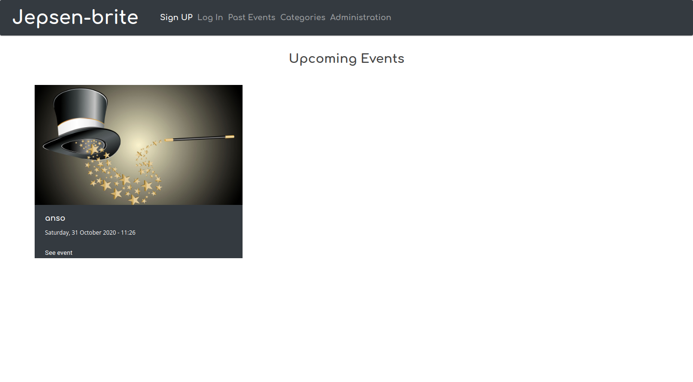

# BeCode: Jepsen-Brite

> 🛰️ Short project's description

* * *

A short abstract of the project, goals, context… Anything that should be useful for a future reader.
An events website 

## About

Technical details:

a SQL database is used for back-end 

PHP for the front-end

The deployment is on HEROKU 

## Installation (if applicable)

Details of process to install / setup dev environment for the project, if applicable.

## Usage (if applicable)

How to use the project, if applicable

## SreenShot

* * *

October 2020, Ruben Lomo Maetsu & Arnaud De Baerdemaeker & Anne-Sophie Simana.